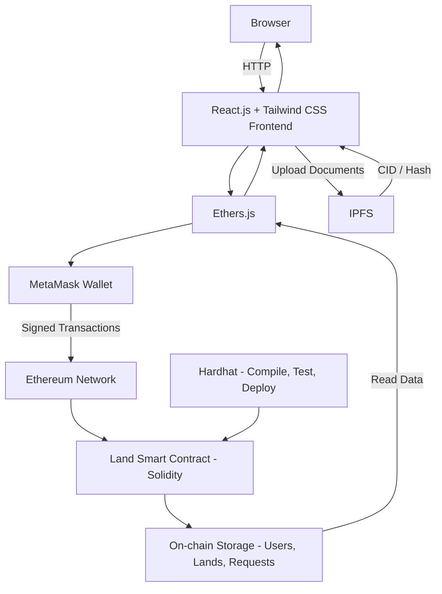
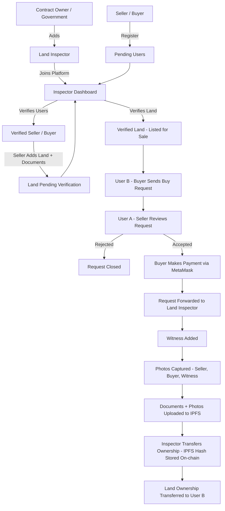

# Land Registry DApp

## Description

**Land Registry DApp** is a decentralized application built on the Ethereum blockchain that digitizes the complete lifecycle of land registration and property transfer. Users register on the platform, list their lands, and buy or sell them directly with other verified users. Government-appointed **Land Inspectors** verify users and land records, and finalize the ownership transfer once payment is complete.

Every record (user, land, request, payment, ownership change) is stored on-chain through a Solidity smart contract, while documents such as land papers and ownership deeds are stored on **IPFS** and referenced by hash on the blockchain.

### Key Features

- **Role-based access**: Contract Owner (admin), Land Inspector, and User (Buyer / Seller)
- **User registration & verification**: Aadhar, PAN and document details verified by an inspector
- **Land registration**: area, address, price, GPS coordinates, property PID, survey number and document
- **Land verification** by Land Inspectors before it can be traded
- **Buy / sell workflow**: request → accept / reject → payment → ownership transfer
- **Witness and photo verification**: photos of seller, buyer and witness plus their documents are captured and stored on IPFS before transfer
- **Direct ETH payment** from buyer to seller through MetaMask
- **Decentralized document storage** using IPFS
- **Transparent history**: all actions are recorded on the blockchain and cannot be altered

---

## Problem It Solves

Traditional land registration systems have many issues:

| Problem | How this project solves it |
|---|---|
| **Land fraud & forged documents** | Records are immutable on the blockchain and documents are hashed on IPFS |
| **Duplicate / double selling of the same land** | Ownership is stored in a single source of truth (smart contract) |
| **Corruption & middlemen** | Buyer and seller interact directly; payment goes straight to the seller |
| **Lack of transparency** | Anyone can verify land details and ownership history on-chain |
| **Slow, paper-based process** | Requests, approvals and payments happen digitally in minutes |
| **Centralized data tampering or loss** | Data is distributed across the Ethereum network and IPFS |

---

## Tech Stack

### Frontend
- **React.js**: UI library
- **Tailwind CSS**: styling
- **Ethers.js**: interaction with the smart contract and blockchain

### Blockchain
- **Solidity** (`^0.8.8`): smart contract language
- **Ethereum**: blockchain network
- **Hardhat**: development, testing and deployment framework

### Wallet & Storage
- **MetaMask**: wallet for signing transactions and making payments
- **IPFS**: decentralized storage for land documents and ownership deeds

---

## Architecture Diagram



### Workflow



---

## Roles & Permissions

| Role | Capabilities |
|---|---|
| **Contract Owner** | Add / remove Land Inspectors, change contract owner |
| **Land Inspector** | Verify users, verify land, finalize ownership transfer |
| **User (Seller)** | Register, add land, list land for sale, accept / reject buy requests |
| **User (Buyer)** | Register, send buy requests, make payment |

---

## Project Structure

```
land-registry/
├── contracts/
│   └── Land.sol
├── scripts/
│   └── deploy.js
├── test/
├── frontend/
│   ├── src/
│   │   ├── components/
│   │   ├── pages/
│   │   └── utils/
│   └── tailwind.config.js
├── hardhat.config.js
└── README.md
```

---

## Getting Started

### Prerequisites
- [Node.js](https://nodejs.org/) (v16+)
- [MetaMask](https://metamask.io/) browser extension
- An IPFS provider account (e.g. Pinata) or a local IPFS node

### Installation

```bash
# Clone the repository
git clone https://github.com/<your-username>/land-registry.git
cd land-registry

# Install dependencies
npm install
cd frontend && npm install
```

### Run Locally

```bash
# 1. Start a local Hardhat blockchain
npx hardhat node

# 2. Deploy the smart contract (in a new terminal)
npx hardhat run scripts/deploy.js --network localhost

# 3. Start the frontend
cd frontend
npm start
```

Then connect MetaMask to `http://127.0.0.1:8545` (Chain ID `31337`) and import one of the Hardhat test accounts.

---

## Smart Contract Overview

| Function | Description |
|---|---|
| `addLandInspector()` / `removeLandInspector()` | Manage inspectors (owner only) |
| `registerUser()` / `verifyUser()` | User onboarding and verification |
| `addLand()` / `verifyLand()` | Register and verify land |
| `makeItforSell()` | List land for sale |
| `requestForBuy()` | Buyer requests a land |
| `acceptRequest()` / `rejectRequest()` | Seller responds |
| `makePayment()` | Buyer pays the seller in ETH |
| `transferOwnerShip()` | Inspector finalizes the transfer |

---

## Future Improvements

- Land price check inside `makePayment()` (enforce `msg.value == landPrice`)
- Event emission for all major actions
- Ownership history / land transaction timeline
- Multi-signature approval by inspectors
- Deployment on a public testnet (Sepolia) and mainnet-ready audit

---

## Contributing

Contributions are welcome! Fork the repo, create a feature branch, and open a pull request.

## License

This project is licensed under the [MIT License](LICENSE).
